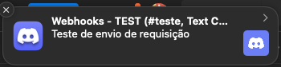
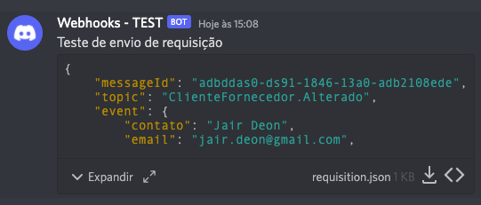

# Proposta
Atualmente, em alguns sistemas que estou trabalhando, preciso realizar algumas integrações com webhooks.

Um webhook, é uma notificação enviada por um servidor, para que outros serviços que dele dependem, possam realizar ações automáticas para manter a sincronização de dados, porém, em muitos casos, o webhook necessita de um serviço online para receber estas chamadas.

A proposta desta solução, é que um serviço realizar uma requisição do tipo POST para uma das rotas cadastradas na aplicação, o sistema possa criar um arquivo armazenando um json com seus valores, e em seguida enviar para o discord com o arquivo da requisição em anexo.
Desta forma, após subir esta aplicação em um servidor online, será possível receber as notificações dos servidores e realizar testes locais até que seja possível subir sua aplicação em produção com os parâmetros corretos tratando os retornos destas requisições.

Ainda é um projeto inicial, e devo melhorar com o tempo.

### O que preciso para começar?
1. Uma aplicação PHP > 8
2. Composer
3. Um servidor web (apache ou nginx)

### Como faço para instalar o projeto?
1. Faça um clone do repositório ``` git clone https://github.com/jairdeon/webhook-server ```
2. Abra em sua IDE preferida e execute "composer install"
3. Execute o projeto utilizando a pasta public como a root do host do seu servidor (no meu caso, costumo utilizar o host como http://webhook-server.web)

### Como consigo realizar um teste?
- Crie um arquivo na raiz do projeto com o nome .env, e crie a variável ```TEST_DISCORD_WEBHOOK``` [apontando para o link de destino do seu canal do discord](https://support.discord.com/hc/pt-br/articles/228383668-Usando-Webhooks)
- No arquivo index.php, na pasta public temos uma rota apontando para /api/v1/test
- Utilizando um serviço de envio POST (como o postman por exemplo, faça um envido do tipo POST de qualquer JSON)

```json
{
   "messageId": "adbddas0-ds91-1846-13a0-adb2108ede",
   "topic": "ClienteFornecedor.Alterado",
   "event": {
      "contato": "Jair Deon",
      "email": "jair.deon@gmail.com",
      "homepage": "https://www.jairdeon.com"
   },
   "author": {
      "email": "jair.deon@gmail.com",
      "name": "Jair Deon",
      "userId": 1
   },
   "appKey": "169938472489",
   "appHash": "jair-d02831",
   "origin": "webhook-server"
}
```
---
- Caso funcione como o esperado, você receberá uma notificação no discord.



